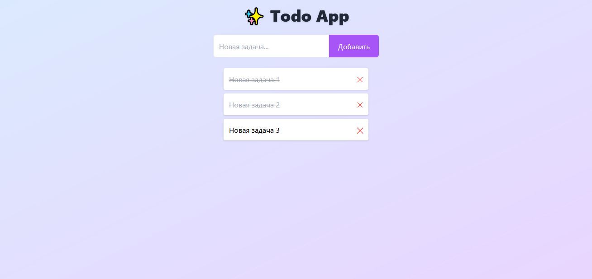

## 📝 Todo App (Django + DRF + React + Tailwind)

Современное веб-приложение для управления задачами (to-do list)  
с разделением на **Backend (Django + DRF)** и **Frontend (React + Tailwind + Vite)**.

## Скриншоты



---

## Функционал

- Добавление новых задач
- Отметка задач как выполненных
- Удаление задач
- Анимации и современный UI на Tailwind
- REST API (Django REST Framework)

---

## Технологии

## Backend
- Python 3.x
- Django 5
- Django REST Framework
- Django CORS Headers

## Frontend
- React 18
- TailwindCSS 3
- Vite
- Framer Motion (анимации)

---

## Установка и запуск проекта локально

Клонируем репозиторий

```bash
git clone https://github.com/<ваш_логин>/<имя_репозитория>.git
cd todo_project

Настройка Backend (Django)

    Создаём и активируем виртуальное окружение:

Windows

python -m venv venv
venv\Scripts\activate

Linux / Mac

python3 -m venv venv
source venv/bin/activate

    Устанавливаем зависимости:

pip install -r requirements.txt

    Делаем миграции и запускаем сервер:

cd backend
python manage.py migrate
python manage.py runserver

Сервер доступен по адресу:
http://127.0.0.1:8000/

Настройка Frontend (React + Tailwind)

    Переходим в папку фронтенда:

cd ../frontend

    Устанавливаем зависимости:

npm install

    Запуск фронтенда в режиме разработки:

npm run dev

Фронтенд будет доступен по адресу:
http://127.0.0.1:5173/ (или другом, который выведет Vite)

Сборка фронтенда для продакшена

npm run build

После сборки создастся папка dist/.
Её можно подключить к Django через STATICFILES_DIRS для единого продакшн-приложения.
